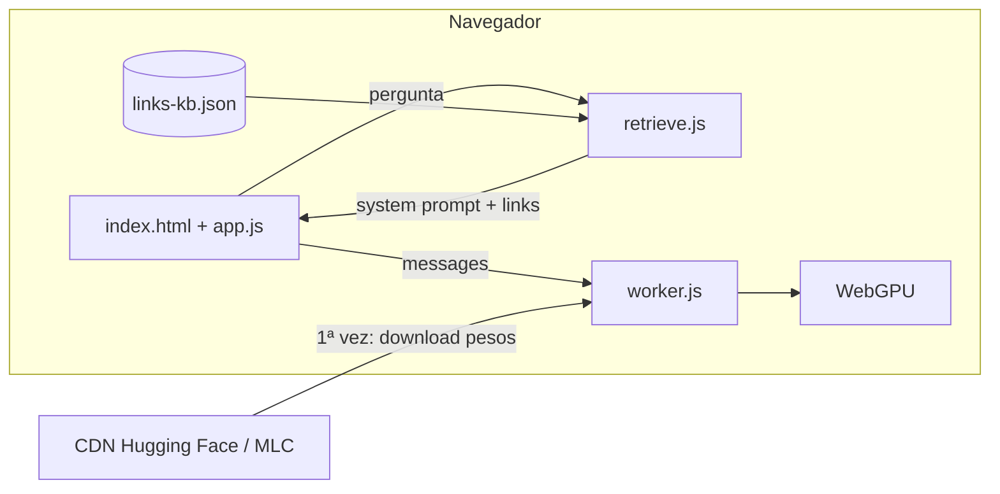
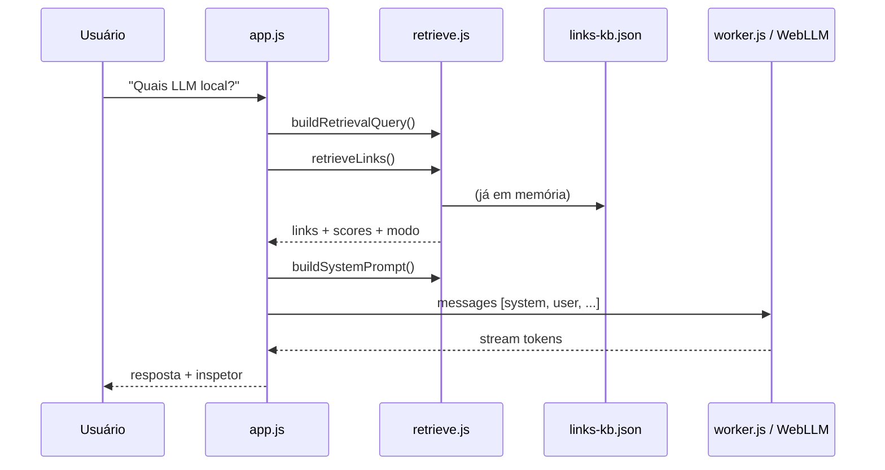

# Explicação do projeto — llm-navegador

Guia para entender o código, gravar vídeo (YouTube/aula) ou apresentar a demo. Para rodar o projeto, veja [README.md](README.md). Para modelos MLC e quantização, veja [modelos.md](modelos.md).

---

## Visão geral em 30 segundos

Demo educativa: um **LLM roda inteiro no navegador** (sem API key, sem servidor de inferência) e responde sobre a curadoria [marcelocabral.com.br/links](https://marcelocabral.com.br/links) usando **RAG simples** (busca por palavras-chave + contexto no *system prompt*).



1. O usuário pergunta no chat.
2. A **RAG** busca links relevantes no JSON local.
3. Os links entram no **system prompt**.
4. O **WebLLM** (no Worker) gera a resposta na **GPU** via WebGPU.
5. O **Inspetor** mostra tudo: RAG, prompt, JSON enviado, resposta, métricas.

---

## Como o modelo é baixado

**Não há download manual.** O repositório não inclui os pesos do modelo.

| Etapa | Onde | O que acontece |
|-------|------|----------------|
| 1 | `models.js` | Lê o catálogo oficial `prebuiltAppConfig` do pacote `@mlc-ai/web-llm` (via CDN `esm.run`). |
| 2 | `app.js` → `initEngine()` | Chama `CreateWebWorkerMLCEngine(worker, modelId, { initProgressCallback })`. |
| 3 | `worker.js` | Repassa mensagens para `WebWorkerMLCEngineHandler` — inferência fora da thread da UI. |
| 4 | WebLLM (biblioteca) | Na **1ª vez**, baixa o **pacote MLC** (~300 MB–1,5 GB conforme o modelo) de URLs do Hugging Face / infra MLC. |
| 5 | Navegador | Grava em **cache** (IndexedDB / Cache API). Na 2ª visita fica bem mais rápido. |

Trecho central em `app.js`:

```javascript
async function createMlcEngine(modelId, initProgressCallback) {
  const worker = new Worker(new URL("./worker.js", import.meta.url), {
    type: "module",
  });
  const eng = await CreateWebWorkerMLCEngine(worker, modelId, {
    initProgressCallback,
  });
  return eng;
}
```

O `worker.js` inteiro é um adaptador mínimo (8 linhas) para o WebLLM rodar em background sem travar a página.

**Requisitos:**

- **Chrome** ou **Edge** com **WebGPU**
- Servidor HTTP local (`file://` quebra Workers)
- Internet na **primeira carga**
- Modelo padrão: `Qwen2.5-0.5B-Instruct-q4f32_1-MLC` (leve; para RAG melhor, prefira **1.5B**)
- `q4f32` = 4-bit + cálculo em float32 (mais compatível no Windows que `q4f16`)

Detalhes do formato MLC, `model_id` e modelos customizados: [modelos.md](modelos.md).

---

## Onde está a RAG

**Não é RAG com embeddings** (sem Chroma, Pinecone, vetores). É **recuperação por palavras-chave + regras** em [`retrieve.js`](retrieve.js), sobre [`data/links-kb.json`](data/links-kb.json).

### Fluxo de uma pergunta



### Funções principais (`retrieve.js`)

| Função | Papel |
|--------|--------|
| `buildRetrievalQuery()` | Se a pergunta for vaga (“liste”, “quais”), junta com as 2 últimas mensagens do usuário. |
| `retrieveLinks()` | Define o **modo** (saudação, lista por categoria, busca por score, fallback, etc.) e retorna links com **score**. |
| `scoreLink()` | Pontua: título (+4), categoria (+5), tags (+3), descrição (+1). |
| `buildSystemPrompt()` | Monta o system prompt com regras (“não invente sites”) + bloco `LINKS RECUPERADOS`. |
| `formatContextBlock()` | Formata cada link para o LLM ler. |

Modos de recuperação comuns: `keyword`, `category-list`, `category-list-free`, `greeting`, `catalog-help`, `utility-text`, `fallback-featured`.

O contexto injetado no prompt segue este formato:

```
--- LINKS RECUPERADOS (contexto RAG) ---
[1] Título (Categoria)
URL: ...
Descrição: ...
Tags: ...
--- FIM DO CONTEXTO ---
```

**Orquestração** em `app.js` (`handleUserMessage`):

1. `buildRetrievalQuery(query, priorMessages)`
2. `retrieveLinks(retrievalQuery, kbLinks, 12)`
3. `buildSystemPrompt(results, meta)`
4. `buildMessagesForEngine(systemPrompt, chatHistory)` → `[{ role: "system", ... }, ...histórico]`
5. `engine.chat.completions.create({ messages, stream: true, ... })`

**Conclusão:** RAG = recuperar trechos + colar no *system prompt*. O modelo **não** foi fine-tuned na curadoria.

### Base de conhecimento

Arquivo [`data/links-kb.json`](data/links-kb.json): **46 links** com `title`, `category`, `description`, `tags`, `url`, `featured`. Carregado no início via `fetch` em `loadKnowledgeBase()`. É **estático** — não sincroniza com o site ao vivo.

---

## Mapa dos arquivos

| Arquivo | Função |
|---------|--------|
| [`index.html`](index.html) | Layout: 3 colunas (aula \| chat \| inspetor), overlay de loading, seletor de modelo, métricas. |
| [`styles.css`](styles.css) | Tema escuro, layout responsivo, overlay de progresso. |
| [`app.js`](app.js) | **Cérebro:** UI, carrega KB, inicia WebLLM, RAG → prompt → streaming, inspetor, troca de modelo, métricas, erros GPU. |
| [`worker.js`](worker.js) | Web Worker mínimo para WebLLM não travar a interface. |
| [`retrieve.js`](retrieve.js) | Toda a lógica **RAG** (busca, filtros free/freemium, modos de prompt). |
| [`models.js`](models.js) | Catálogo WebLLM, famílias, quantização, descrições, avisos de VRAM. |
| [`metrics.js`](metrics.js) | RAM (heap/aba), GPU (vendor/limite buffer), tokens/s. |
| [`data/links-kb.json`](data/links-kb.json) | Base de conhecimento (46 links). |
| [`modelos.md`](modelos.md) | Modelos MLC: origem, quantização, custom, limitações. |
| [`scripts/smoke-test.mjs`](scripts/smoke-test.mjs) | Teste automatizado (precisa GPU). |
| [`package.json`](package.json) | `npm start` → `serve` na porta 8080. |

**Dependência externa (CDN, não no `package.json`):**

- `@mlc-ai/web-llm` via `https://esm.run/@mlc-ai/web-llm`

---

## Inspetor (painel didático)

Cada turno de chat guarda um objeto `turn` com dados para ensinar:

| Aba | Conteúdo |
|-----|----------|
| **RAG** | Links recuperados + **score** + modo (`keyword`, `category-list`, etc.) |
| **System** | Prompt completo com `LINKS RECUPERADOS` |
| **Messages** | JSON enviado ao WebLLM (`system` + histórico) |
| **Resposta** | Texto final + chunks do stream |
| **Meta** | Modelo, tempo, tokens, tok/s |

O histórico enviado ao LLM é **limitado** (`MAX_LLM_HISTORY_MESSAGES = 4`, respostas do assistente cortadas em 600 caracteres) para não estourar o contexto em modelos pequenos.

---

## Métricas na interface

Implementadas em [`metrics.js`](metrics.js), exibidas no cabeçalho:

| Métrica | Fonte |
|---------|--------|
| **RAM** | `performance.memory` ou `measureUserAgentSpecificMemory` (Chrome) |
| **VRAM / GPU** | WebLLM: fabricante e limite de buffer — o browser **não** expõe VRAM em uso |
| **Tokens/s** | Estimativa durante o stream + `usage.extra` do WebLLM ao final |

---

## Roteiro sugerido para vídeo (5–8 min)

1. **Hook (30 s)** — “LLM no navegador, sem API, sem servidor — só HTML/JS + WebGPU.”
2. **Rodar (1 min)** — `npx serve . -p 8080`, abrir `http://localhost:8080`, overlay de download na 1ª vez.
3. **Arquitetura (1,5 min)** — 3 colunas; diagrama pergunta → RAG → prompt → Worker → GPU.
4. **Demo RAG (2 min)** — Chip “LLM local”; Inspetor **RAG** (scores); aba **System** (contexto); “não é fine-tuning”.
5. **Inferência (1 min)** — Streaming; métricas RAM/GPU/tok/s; Worker mantém UI responsiva.
6. **Modelos e cache (1 min)** — Trocar modelo no select; cache na 2ª vez; `q4f32` no Windows → [modelos.md](modelos.md).
7. **Limitações (30 s)** — Modelo pequeno pode errar; KB estática; precisa WebGPU.

Checklist rápido (igual ao [README](README.md)):

1. Overlay de loading e log de etapas.
2. Status **Pronto** → colunas Como funciona | Chat | Inspetor.
3. Chip “LLM local” (ou outro).
4. Inspetor → **RAG** (links + score).
5. Aba **System** (prompt com contexto).
6. Aba **Messages** (JSON para WebLLM).
7. Streaming; depois **Resposta** e **Meta**.
8. F5 → loading mais rápido (cache).

---

## Frases prontas para apresentação

| Pergunta | Resposta curta |
|----------|----------------|
| Onde o modelo mora? | Nos servidores Hugging Face/MLC; o browser baixa e cacheia. Nada no Git. |
| Onde está a RAG? | `retrieve.js` + `links-kb.json`, antes da chamada ao LLM. |
| Por que Worker? | Download e inferência são pesados; sem Worker a página congela. |
| É RAG “de verdade”? | Sim: retrieval + augmentation no prompt. Não usa embeddings vetoriais. |
| Precisa de backend de IA? | Não — só servidor estático para arquivos e Workers. |

---

## Limitações (honestas)

- Modelos pequenos podem ignorar o RAG ou repetir texto; o prompt e `detectStreamLoop` mitigam isso.
- KB estática; não atualiza sozinha com o site.
- Firefox: WebGPU variável.
- Troca para modelos grandes pode falhar por VRAM — ver [modelos.md](modelos.md).

---

## Comandos úteis

```bash
npm start                    # http://localhost:8080
npm run test:rag             # testa retrieveLinks no terminal
npm run test:smoke           # E2E com Playwright (precisa GPU)
```

---

## Documentação relacionada

- [README.md](README.md) — como rodar, testes, erros comuns
- [modelos.md](modelos.md) — catálogo WebLLM, pacote MLC, quantização, modelos customizados
